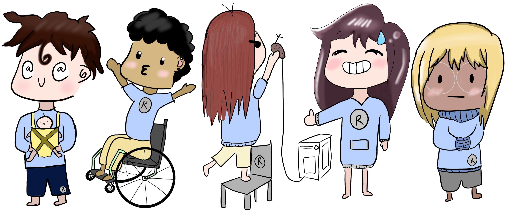

# Who is this book for {-}

```{r, echo=FALSE, fig.cap="Personas drawn by Julia Chen"}

```


This book is for people who work in the biomedical sciences.
This includes the clinicians (MDs, DOs, DVMs RNs, PAs, etc),
researchers, programmers, and students who work with data.

## The Personas {-}

As a part of a research study, we have identified 4 different groups (i.e., personas)
in the biomedical sciences who this set of materials are for.

### Alex Academic {-}

```{r, echo=FALSE, fig.cap="Drawn by Julia Chen", out.width= "20%", out.extra='style="float:right; padding:10px"'}

```


**Background**

Alex, a professor of bioinformatics, studies molecular dynamics of proteins and protein-protein interactions.
They are also responsible for teaching an introduction to research to 100 freshman and sophomore students every year.
They also run a data consulting service at their university, providing support for data-related challenges to research and instructors from any discipline. 

Students complain that intro courses in programming are too theoretical and require more programming knowledge than they have.
Many students in the department also cannot register for similar classes.
Alex, has 10s of students working for them in computational molecular dynamics simulations and other data analytics projects.

**Relevant prior knowledge or experience**

Alex performs their research using a combination of Excel spreadsheets and specialized software,
but is switching to R or Python (which they taught themself during a sabbatical).
They have never taken a formal programming course, and suffers from impostor syndrome in discussions about programming.
Alex would like to learn more about how programming can help their research and keep up with the tools their students are learning in class.

**Perception of needs**

Alex needs workshops (so they can allocate focused time) and how-to guides (for research).
They would like ready-to-use lesson material that could be remixed for their students and some orientation material to demystify jargon (what is "tidy data"?).
Alex also wants to be able to use the same tools in their research as in their teaching to amortize learning costs and stay in practice.

**Special considerations**

Alex wants to provide technical training to students, but does not have the actual time to teach all the relevant skills.
As a person in STEM, they typically find themselves isolated and alone when taking formal technical classes
and is scared to appear ignorant, and are reluctant to speak up and ask questions.

### Clare Clinician {-}

```{r, echo=FALSE, fig.cap="Drawn by Julia Chen", out.width= "20%", out.extra='style="float:left; padding:10px"'}

```

**Background**

Clare has spent the last 6 years working in the Cardiothroasic ICU in a large medical hospital system.
They read lots of gushing articles about data science, and was excited by the prospect of learning how to do it,
but nothing makes sense when trying to learn it on their own.
Clare has always been a good student and always excelled at things they tried to learn;
they are hard on themselves when struggling to learn a new skill and
would rather place blame on the long hours at work than having their peers know they could use assistance.

**Relevant prior knowledge or experience**

Clare keeps up with medical research, but has little to no experience in doing medical research.
They use Excel for non-data related tasks (e.g., making lists), or manually inputting patient data into spreadsheets for chart reviews.
Wants to be able to collect and manage data as well as learn about the process behind data analysis to perform their own analysis and study one day.

**Perception of needs**

Clare wants self-paced tutorials with practice exercises, plus forums where they can ask for help.
They also need short overviews to orient them and introductory tutorials that include videos or animated GIFs showing exactly how to drive the tools,
and that use datasets they can relate to.
Clare wishes they had a community of other people in the medical field who are interested in learning how to do data work so they can learn and ask questions.

**Special considerations**

Clare is a single parent who juggle their time at work and at home who are strapped for time to learn a new skill.

### Patricia Programmer {-}

```{r, echo=FALSE, fig.cap="Drawn by Julia Chen", out.width= "20%", out.extra='style="float:right; padding:10px"'}
knitr::include_graphics("./images/personas/patricia.jpg")
```

**Background**

Patricia works as an analyst in the department of biomedical informatics at a research hospital.
They grew up in Montreal, Canada and is fluent in both French and English.
Patricia uses Python and R and is currently working on a project looking at 30-day readmittance rates in the emergency room for patients with heart problems.
Because of all the tools Patricia uses for work, they work closely with IT to implement infrastructure and
installations that are needed for their analytics work, and frequently help other people with technical issues
and knows how to communicate with IT to resolve problems.
Since all their work is computational Patricia spends a lot of time working remotely at home.

**Relevant prior knowledge or experience**

Patricia regularly connects to a remote server to do their work.
They write SQL statements to pull data out of Epic and processes the data in both Python and R to generate reports and dashboards for their team and management.
Patricia writes data pipelines for all their work either by combining shell scripts or build scripts.

**Perception of needs**

Patricia wants how-to guides and reference material for their day-to-day work
and short, intensive online training for very specific topics.
Because they often jump around between various tools, Patricia wants a way to quickly review topics before starting a new project.

**Special considerations**

Patricia does not have access to a stable and reliable internet connection at home.

### Samir Student {-}

```{r, echo=FALSE, fig.cap="Drawn by Julia Chen", out.width= "20%", out.extra='style="float:left; padding:10px"'}

```

**Background**

Samir is a graduate student in a bioinformatics program.
They worked in a wet lab doing bench since their undergraduate days studying neuroscience.
These days Samir is doing more computational work and starting to use programming based tools to
look at protein structures.
They've taken a few classes that had had programming based homework assignments and projects,
but the lectures themselves were mostly around theory,
and many of the programming skills were self-taught.

**Relevant prior knowledge or experience**

Samir is fairly proficient in Excel and does works with spreadsheets regularly and
knows how to load up Excel spreadsheets into R and do basic data processing and analysis.
However, they do not have that much practice outside of a classroom homework and project setting,
and spends a lot of their time on StackOverflow copying and pasting code so they don't consider themselves a "real programmer".
They have no problem getting their work done, but usually involves a lot of googling to eventually get the solution.

**Perception of needs**

Samir wants a formal workshop and reference materials that can be used to build a good foundation of the programming skills they were never taught.
They want a better understanding of the terminology and jargon used in data science so they have the vocabulary to
search for and understand solutions posted online. They are also looking for a community to help in their growth as a student in this domain. 

**Special considerations**

Samir has a disability (vision, hearing, attention, etc) that make it difficult to learn in "traditional" classroom settings.
