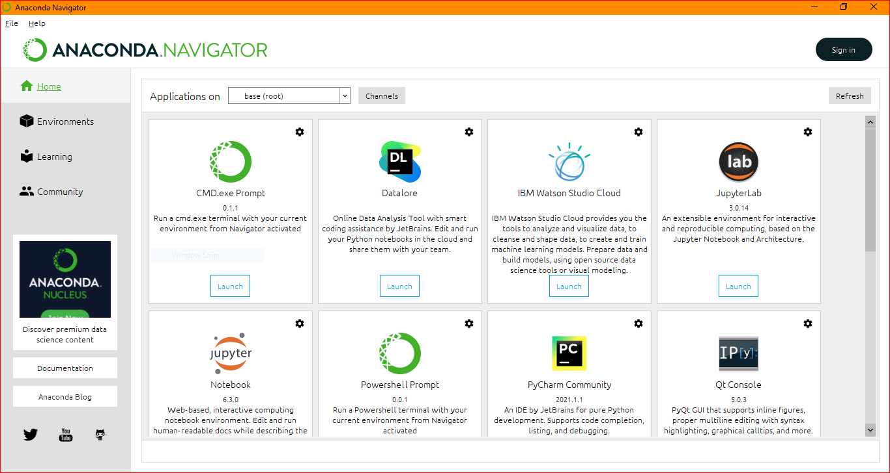
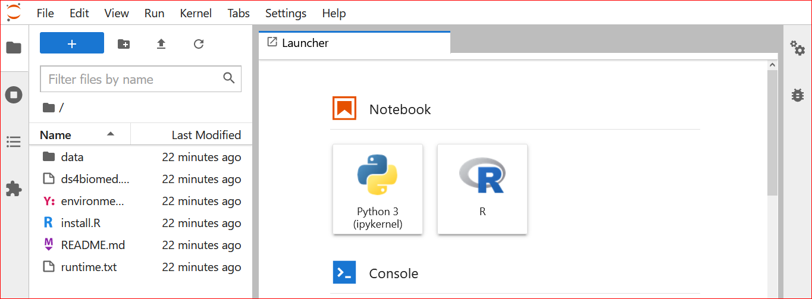
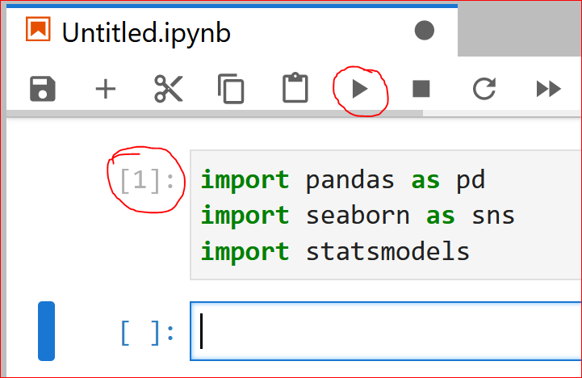

```{r, include=FALSE}
knitr::opts_chunk$set(echo=FALSE)
```

# Setup {-#setup}

To prepare to follow along, you will need to have
the datasets downloaded,
some spreadsheet program (e.g., Excel),
and a programming language (e.g., R) installed.
See the below sections for how to get everything set up 

## Datasets {-}

You can find all the datasets needed from the workshop from the book's GitHub Page:

https://github.com/chendaniely/ds4biomed

You can click on the "Code" drop-down and select "Download Zip" to download the data and files for the lesson materials.

```{r}
knitr::include_graphics("./images/setup/github-download_zip.PNG")
```


## Spreadsheet {-}

Microsoft Excel and Google Sheets are the more common types of spreadsheet software used.
If you do not have Excel, there are other free options available:

- LibreOffice (Free and open source): https://www.libreoffice.org/
- FreeOffice (Free but closed source): https://www.freeoffice.com/en/

All of these programs can read and write Excel and comma delineated (CSV) files,
which you can use to follow along.

## Programming language {-}

Below you will find the installation instructions for setting up the programming language we will be using (e.g., R, Python) along with its programming environment (e.g., RStudio, Jupyter)

::::: {.rBlock}
### R {-}

We will be using R and RStudio for the workshop.
If you would like a video installation tutorial,
please see the
[R section of The Carpentries workshop template](https://carpentries.github.io/workshop-template/#r)
.

The links to install R can be found here: https://cloud.r-project.org/.
Navigate to the correct operating system.

```{r, fig.cap='Screenshot of the "Download and Install R" section.'}
knitr::include_graphics("./images/setup/website-r_download.PNG")
```

For mac users, download the `.pkg` file under the "Latest release" section

```{r, fig.cap="Section of the Mac download page to download the Mac .pkg file."}
knitr::include_graphics("./images/setup/website-r_download-mac.PNG")
```

For Windows users, please install both the `base` version as well as `Rtools`.

```{r, fig.cap="Section of the Windows download page to download both the base and Rtools installers."}
knitr::include_graphics("./images/setup/website-r_download-windows.PNG")
```

#### RStudio {-}

After you have installed R, you can install RStudio.
We will use RStudio as the integrated development environment (IDE) to write and work with R code.
Rstudio can be downloaded from the following location: https://rstudio.com/products/rstudio/download/

#### Installing R packages {-}

Once we have 
Within RStudio, there will be a "Packages" tab in the bottom right panel.
Click on the "Install" button.

```{r, fig.cap="Zoom of the Rstudio Packages tab in the bottom right quadrant showing the Install button."}
knitr::include_graphics("./images/setup/rstudio-packages_tab.PNG")
```

In the pop-up window type in "tidyverse remotes" and click "install".

```{r, fig.cap="Install Packages dialog box after clicking the Install button showing how to install tidyverse library."}
knitr::include_graphics("./images/setup/rstudio-install_packages.PNG")
```

The Console section of RStudio will begin installing the `tidyverse` package we will be using.
The `remotes` package will be used to install the `medicaldata` package for some of the medical datasets we will be using.
On the left side you should see a "Console" tab.
To install the `medicaldata` package type in:

```r
remotes::install_github("higgi13425/medicaldata")
```

```{r, fig.cap="Screenshot of running remotes::install_github(\"higgi13425/medicaldata\")."}
knitr::include_graphics("./images/binder/binder-install-medicaldata.PNG")
```

#### Testing your R installation {-}

When the installation is finished, you can check if the package was installed properly and will load
by scrolling down the "Packages" tab and clicking the check-box next to "tidyverse".

```{r, fig.cap="RStudio Packages tab in the bottom right quadrant with the tidyverse library checked off."}
knitr::include_graphics("./images/setup/rstudio-check_tidyverse.PNG")
```
:::::

::::: {.pyBlock}
### Python {-}

We will be using the Anaconda distribution for Python.
The download links and instructions can be found here: https://docs.anaconda.com/anaconda/install/.

You can accept all the default options for the installation.
The Anaconda installation direction has this to say about the advanced options presented during the installation:

> Choose whether to add Anaconda to your PATH environment variable. We recommend not adding Anaconda to the PATH environment variable, since this can interfere with other software. Instead, use Anaconda software by opening Anaconda Navigator or the Anaconda Prompt from the Start Menu.

> Choose whether to register Anaconda as your default Python. Unless you plan on installing and running multiple versions of Anaconda or multiple versions of Python, accept the default and leave this box checked.

The end of the installer gives you the option to install the PyCharm Integrated Development Environment.
We will not be using PyCharm for the workshop,
but you can install and use that instead of JupyterLab, if you wish.

<!--
Install Python 3 by running the Anaconda Installer,
using all of the defaults for installation **except, make sure to check Add Anaconda to my PATH environment variable**.

You can also follow the [Software-Carpentry Python setup instructions](https://carpentries.github.io/workshop-template/#python)
-->


#### Testing your Python installation {-}

For Windows + Mac, Anaconda comes with the "Anaconda Navigator" application.
It's normal for it to take a while the first time you launch it.
If you open it, you should be given the option to launch JupyterLab

```{r, fig.cap="Screenshot of Anaconda Navigator. This is an easier and graphical way to view your different Pyhon enviornments, and launch various deveopment environments for Python."}

```

Once you have opened jupyter lab, you can use the file browser on the left side
to open the ds4biomed folder that you have downloaded and unziped/extracted.
Click the "Python 3" button under "Notebook" to launch a Python notebook.

```{r, fig.cap="Screenshot of JupyterLab"}

```

To check that the packages we need are working,
Type the following commands into the open cell block

```python
import pandas as pd
import seaborn as sns
import statsmodels
```

You can then execute and load the packages by pressing the right-triangle "play" button towards the top.
What you should see is a number increment to the left of the code block you typed in the code.
If you see a "*" it means it is still executing the code.

```{r, fig.cap="Executing code in a jupyter notebook that loads up Python packages. The code block will increment if the code has completed executing"}

```


:::::

## Binder (For Installation Issues) {-}

If you are having installation issues,
there is a Binder instance with all the packages and datasets setup that you can use
in a browser.
You can click one of the Binder badges to launch a programming environment for you in the cloud.

Note that these instances can take a very long time to start up and install everything, it can take anywhere from 1 minute to over 30 minutes depending
on how long the last time someone has used a binder instance.

One caveat with Binder is that each instance does not persist any data.
So if you are idle for too long, or close out of the tab,
all the work you did within Binder will be lost.

You will need to either copy/paste your work to a place on your computer,
or export the files out of Binder if you wish to have files saved.

::::: {.rBlock}
### R + RStudio {- #r-rstudio-binder}

- R + RStudio: [](https://mybinder.org/v2/gh/chendaniely/ds4biomed/learner?urlpath=rstudio)
:::::

::::: {.pyBlock}
### Python + Jupyter {- #python-jupyter-binder}

- Python + JupyterLab: [](https://mybinder.org/v2/gh/chendaniely/ds4biomed/learner)
:::::
