```{r, include=FALSE}
knitr::opts_chunk$set(echo=FALSE)
```

# Setup {-#setup}

To prepare to follow along, you will need to have
the datasets downloaded,
some spreadsheet program (e.g., Excel),
and a programming language (e.g., R) installed.
See the below sections for how to get everything set up 

## Datasets {-}

You can find all the datasets needed from the workshop from the book's GitHub Page:

https://github.com/chendaniely/ds4biomed

You can click on the "Code" dropdown and select "Download Zip" to download the data and files for the lesson materials.

```{r}
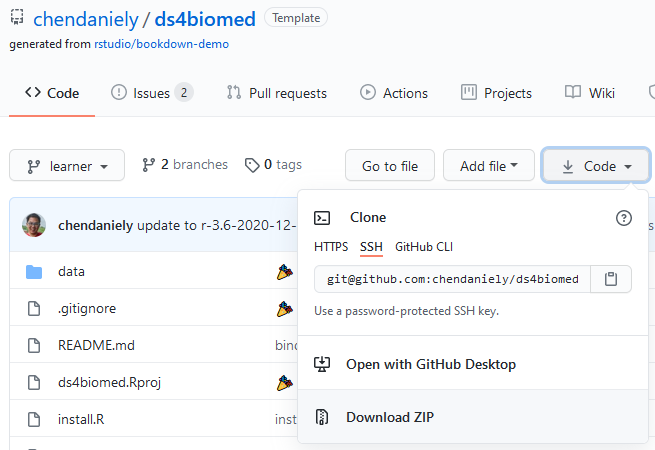
```


## Spreadsheet {-}

Microsoft Excel and Google Sheets are the more common types of spreadsheet software used.
If you do not have Excel, there are other free options availiable:

- LibreOffice (Free and open source): https://www.libreoffice.org/
- FreeOffice (Free but closed source): https://www.freeoffice.com/en/

All of these programs can read and write Excel and comma delineated (CSV) files,
which you can use to follow along.

## Programming language {-}

Below you will find the installation instructions for setting up the programming language we will be using (e.g., R) along with its programming environment (e.g., RStudio)

### R {-}

We will be using R and RStudio for the workshop.
If you would like a video installation tutorial,
please see the
[R section of The Carpentries workshop template](https://carpentries.github.io/workshop-template/#r)
.

The links to install R can be found here: https://cloud.r-project.org/.
Navigate to the correct operating system.

```{r, fig.cap='Screenshot of the "Download and Install R" section.'}
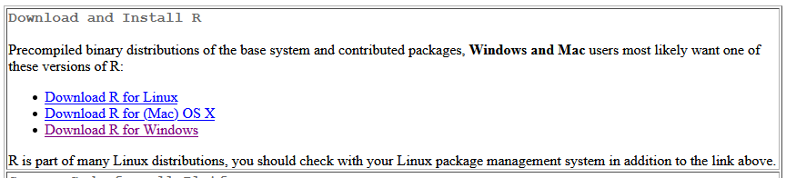
```

For mac users, download the `.pkg` file under the "Latest release" section

```{r, fig.cap="Section of the Mac download page to download the Mac .pkg file."}
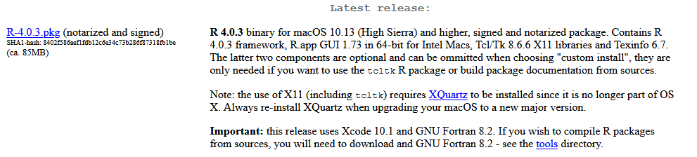
```

For Windows users, please install both the `base` version as well as `Rtools`.

```{r, fig.cap="Section of the Windows download page to download both the base and Rtools installers."}
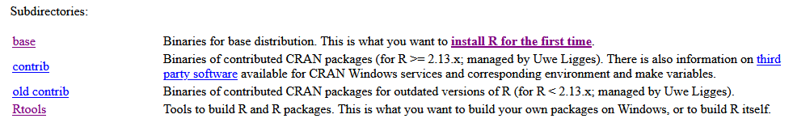
```

#### RStudio {-}

After you have installed R, you can install RStudio.
We will use RStudio as the integrated development environment (IDE) to write and work with R code.
Rstudio can be downloaded from the following location: https://rstudio.com/products/rstudio/download/

#### Installing R packages {-}

Once we have 
Within RStudio, there will be a "Packages" tab in the bottom right panel.
Click on the "Install" button.

```{r, fig.cap="Zoom of the Rstudio Packages tab in the bottom right quadrant showing the Install button."}
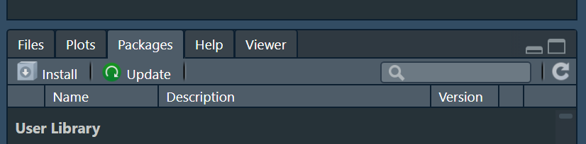
```

In the pop-up window type in "tidyverse" and click "install".

```{r, fig.cap="Install Packages dialog box after clicking the Install button showing how to install tidyverse library."}
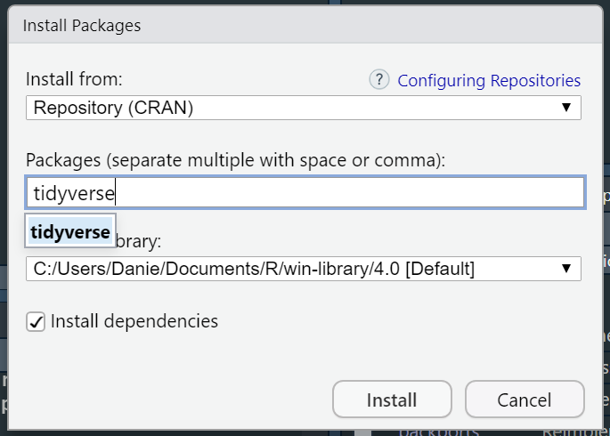
```

The Console section of RStudio will begin installing the "tidyverse" package we will be using.

#### Testing your installation {-}

When the installation is finished, you can check if the package was installed properly and will load
by scrolling down the "Packages" tab and clicking the checkbox next to "tidyverse".

```{r, fig.cap="RStudio Packages tab in the bottom right quadrant with the tidyverse library checked off."}
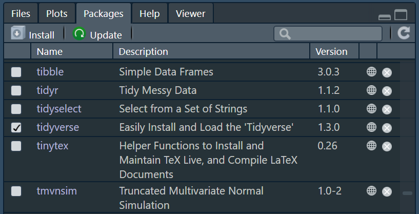
```

## Binder {-}

You can click one of the Binder badges to launch a programming environment for you in the cloud.

### R + RStudio {-}

You may click one of the RStudio Binder badges to launch an RStudio instance.

- RStudio (complete): [](https://mybinder.org/v2/gh/chendaniely/ds4biomed/learner?urlpath=rstudio)
  - This may take a longer time to load, but everything should be set up.
- RStudio (partial): [](http://mybinder.org/v2/gh/binder-examples/r/master?urlpath=rstudio)
  - This may take less time to load, but you need to install some more packages on your own and download the lesson datasets.

To setup the partial RStudio environment,
you need to run the following commands in the bottom left "Console" panel.

```r
install.packages("remotes")
```

```{r, fig.cap="Screenshot of running install.packages(\"remotes\")."}
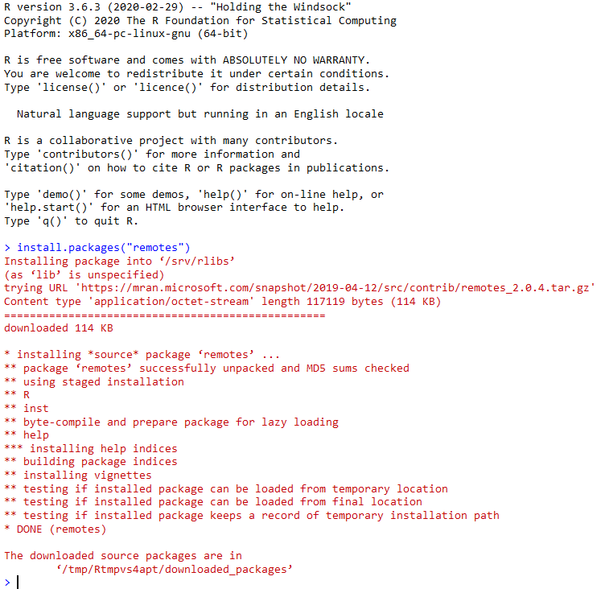
```

Then type the following to install the `medicaldata` package for some of the medical datasets we will be using.

```r
remotes::install_github("higgi13425/medicaldata")
```

```{r, fig.cap="Screenshot of running remotes::install_github(\"higgi13425/medicaldata\")."}
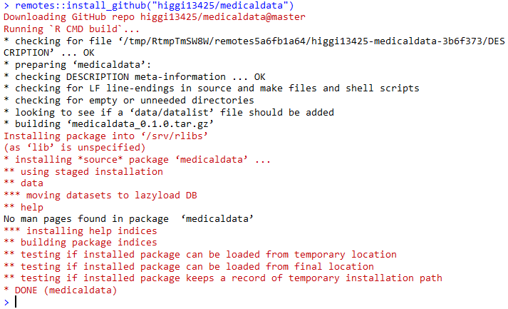
```

To download the data files go to the top right corner and click the `Project (None)` drop down,
and select `New Project...`

```{r, fig.cap="Screenshot of creating a new RStudio project."}
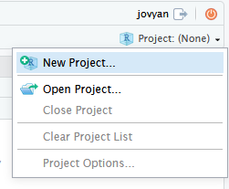
```

Then select `Version Control` > `Git` and paste in `https://github.com/chendaniely/ds4biomed.git` for the `Repository URL`.
You can leave the rest of the parameters as their defaults,
and then click `Create Project`.

```{r, fig.cap="Screenshot of the Clone Git Repository page."}
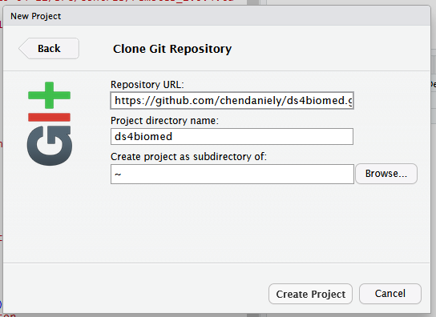
```

When this process finishes,
the bottom right quadrant's "File" tab should show the `ds4biomed` folder and you should see the `data` folder listed.

```{r, fig.cap="Screenshot showing the folders after downloading the lesson materials."}
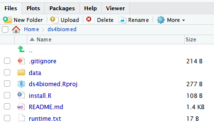
```

<!-- commenting out python section to since we are not using it yet
### Python {-}

We will be using the Anaconda distribution for Python.
The download links and instructions can be found here: https://docs.anaconda.com/anaconda/install/.
-->
