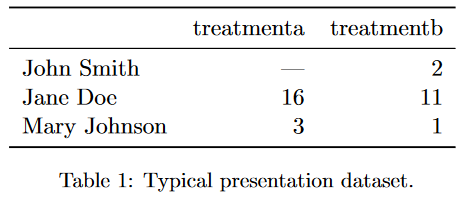
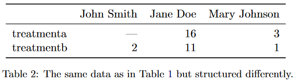
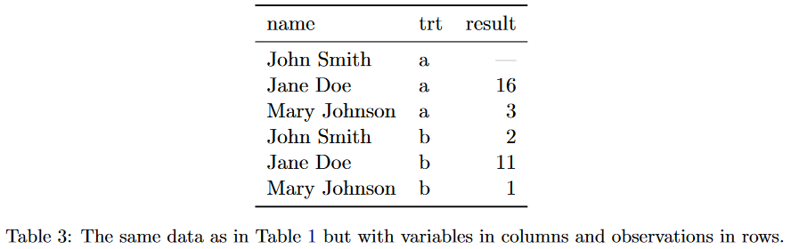
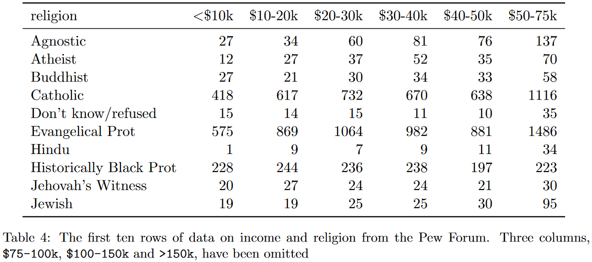
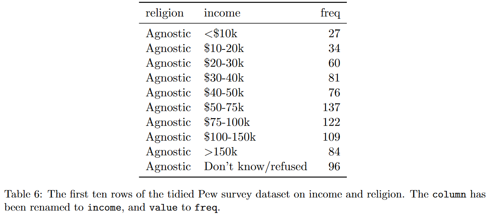
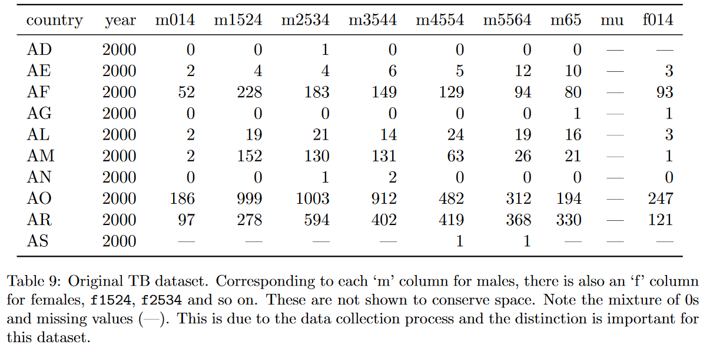
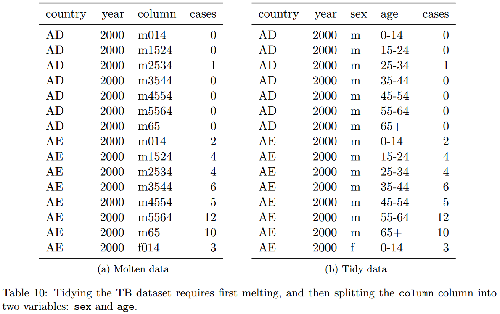
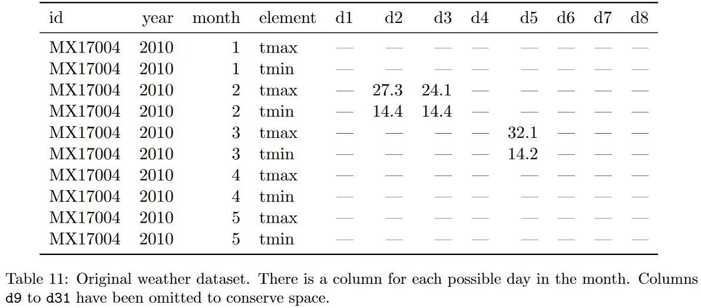
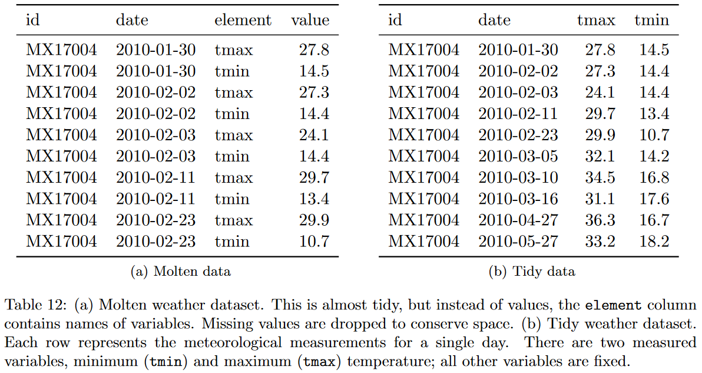

```{r}
knitr::opts_chunk$set(comment = "")
```

# Clean Data (Tidy)

```{r, echo=FALSE, fig.cap="\"Data Cowboy\" by Allison Horst."}
knitr::include_graphics("https://github.com/allisonhorst/stats-illustrations/raw/master/rstats-artwork/data_cowboy.png")
```

## Introduction {#tidy-intro}

Now that we have seen how to import a dataset as a dataframe object,
we can start the process of "cleaning" it.
We saw in the "Spreadsheets" Chapter (\@ref(spreadsheets)) that data could come in different
formats and "shapes" that serve different purposes.
Our Goal now is to start the process of making our dataset "clean"
by making it more amenable to different visualization and modeling methods.
Cleaning, processing, wrangling, tidying, etc are all synonyms you may have heard being used
for this process
(others include screaming, cursing, and walking away).

This chapter is one of the most important concepts in data processing.
It creates a standardized way to talk about a "clean" dataset and structures how you can process your data.
It also serves as a great common ground to move between different programming languages,
since the data manipulation steps are common throughout different languages,
only the actual programming syntax will change.

## What is tidy data?

When we want to "clean" data,
there needs to be some standard way to describe what we mean and some goal to work towards when we are cleaning our dataset.
[Hadley Wickham's 2014 "Tidy Data" paper in the Journal of Statistical Software](https://vita.had.co.nz/papers/tidy-data.pdf)
gives us a formal definition we can use to describe the "shape" of our data.
We will use examples from the paper to define "tidy data".

Below is a duplicate of "Tidy Data's" Table 1.
It shows an example dataset where each row represents a person and columns for some imaginary experiment's treatment values.

```{r, echo=FALSE, fig.cap=""}

```

This is a space efficient representation of our data.
It allows the reader to quickly glance the data values and perform comparisons in their heads.

We can also **transpose** the values of our dataset so the rows and columns are interchanged.

```{r, echo=FALSE, fig.cap=""}

```

Other than making the dataset "wider", we can still do the same set of quick comparisons in this data representation.
These two "shapes" of the same dataset are good for presentations when data needs to be quickly interpreted by a user.
However, remember the `group_by` function we first used in Chapter \@ref(descriptives-intro),
we are unable to perform those aggregate summary statistics in the way our dataset is formatted.

If we organize the data into another shape:

```{r, echo=FALSE, fig.cap=""}

```

We can see it makes doing treatment comparisons more difficult as a reader.
However,
we can now answer the question of "what is the average value for each treatment?"
and from a statistical analysis point of view,
we can now answer the question of "how does treatment affect the result?".
This last example is the "tidy" or "clean" form of our example dataset.

So what aspects of the last table example make it tidy?
The "Tidy Data" paper defines "tidy data" as having 3 features

- Each variable forms a column
- Each observation forms a row
- Each cell is a single measurement

If we compare the "tidy data" definition, we can see how the first 2 table examples violate the "tidy data" definition.
We want a "variable" for person, treatment, and value, not each column containing a single treatment's value or a single person's value.
The unit of interest our dataset stores is a *person's* treatment value,
so each **row** should represent a person.


```{r, echo=FALSE, fig.cap="\"Tidy data is a standard way of mapping the *meaning* of a dataset to its *structure*\" - Hadley Wickham. In tidy data: each *variable* forms a *column*, each *observation* forms a *row*, and each *cell* is a *single measurement*. Wickham, H (2014). Tidy Data. Journal of Statistical Software 59 (10). DOT: 10.18637/jss.v059.i10. Illustrations from the [Openscapes](https://www.openscapes.org/) blog [*Tidy Data for reproducibility, efficiency, and collaboration*](https://www.openscapes.org/blog/2020/10/12/tidy-data/) by Julia Lowndes and Allison Horst"}
knitr::include_graphics("https://github.com/allisonhorst/stats-illustrations/raw/master/rstats-artwork/tidydata_1.jpg")
```

This now gives us the framework to process data so we can begin working with disparate data sets.

```{r, echo=FALSE, fig.cap=""}
knitr::include_graphics("https://github.com/allisonhorst/stats-illustrations/raw/master/rstats-artwork/tidydata_3.jpg")
```

Now that data can be consistently formatted, when we describe a dataset as being "tidy",
we know what that means.
This also makes creating tools and analysis pipelines easier since the shape of our data will be consistent.

```{r, echo=FALSE, fig.cap=""}
knitr::include_graphics("https://github.com/allisonhorst/stats-illustrations/raw/master/rstats-artwork/tidydata_4.jpg")
```

:::{.tldr}
Once you have a tidy dataset, you can easily transform it back to a more presentation friendly view.
:::

## Common data problems

We've discussed what makes data "tidy", but what about *actually* doing it?
Most of the "messy" data sets we see in the world can actually be described as having the same "problems".

- Column headers are values, not variable names
- Multiple variables stored in one column
- Variables are stored in both rows and columns

We will discuss each point in more detail in the following sections.

```{r, echo=FALSE, fig.cap="\"The standard structure of tidy means that 'tidy datasets are all alike ... but every messy dataset is messy in its own way.\" - Hadley Wickham. Tidy data sets saying \"Our columns are variables and our rows are observations\", messy data sets saying \"my columns are values and my rows are variables; I have variables in columns and in rows; I have multiple variables in a single columns; I don't even know what my deal is\". Illustrations from the [Openscapes](https://www.openscapes.org/) blog [*Tidy Data for reproducibility, efficiency, and collaboration*](https://www.openscapes.org/blog/2020/10/12/tidy-data/) by Julia Lowndes and Allison Horst"}
knitr::include_graphics("https://github.com/allisonhorst/stats-illustrations/raw/master/rstats-artwork/tidydata_2.jpg")
```

## Column headers are values, not variable names

This dataset from the Pew Research Center explores the relationship between income and religion in the US.
It shows the religion and frequency for a particular income bracket.

```{r, echo=FALSE, fig.cap="Table 4 from the \"Tidy Data\" paper."}

```

We listed 3 variables the table depicts, but those 3 variables are not the variables (i.e., columns) of the dataset.
The values of the "income" variable are actually the columns of our dataset.
This is the "column headers are values, not variable names" problem with our current dataset.
If we wanted to make it tidy, such that we had 3 columns (religion, income, and frequency),
the data set would look as follows:

```{r, echo=FALSE, fig.cap="Table 6 from the \"Tidy Data\" paper."}

```

The first table is sometimes called the **wide** format
since it has more **columns** and wider to print on the screen,
and the tidy version of the data set example is sometimes called the **long** format
since it has more **rows** and is longer to print on the screen.

Let's go through an example by loading up the `tidyverse` library and our dataset.
Note that the code below has suppressed the message output from loading the library and reading in the dataset.

```{r, message=FALSE}
library(tidyverse)
tumor <- read_csv("./data/tumorgrowth_long.csv")
```

::::: {.pyBlock}
###### Python {-}
```{python}
import pandas as pd

tumor = pd.read_csv("./data/tumorgrowth_long.csv")
```

```{python, echo=FALSE}
pd.options.display.max_columns = 10 # only used for dataframe display
pd.options.display.max_rows = 20
```
:::::

This dataset comes from the [`medicaldata` R package](https://github.com/higgi13425/medicaldata),
curated by Dr. Peter Higgins, M.D. in the
[IBD Research Group at the University of Michigan Medical School](http://www.med.umich.edu/higginslab/).

The dataset we loaded is a modified version of the "tumorgrowth" dataset in the `medicaldata` package.
It shows the treatment group for a particular sample and its size ($mm^3$) over time (days).

> Cells from a human glioma cell line were implanted in the flank of n=37 nude mice and a subcutaneous tumor (xenograft) was allowed to grow.
> When a tumor grew to around 40-60mm^3, the animal was assigned to one of 4 experimenal groups...
> The main outcome in xenograft experiments is the size (volume) of the tumor over time.

You can read more about the dataset and study in the codebook for
["Mixed-Effects Modeling of Tumor Growth in Animal Xenograft Experiments"](https://github.com/higgi13425/medicaldata/blob/master/description_docs/tumorgrowth_desc.pdf)

```{r}
tumor
```

::::: {.pyBlock}
###### Python {-}
```{python}
tumor
```
:::::

Here we have the "column headers are values, not variable names" issue just like the PEW religion dataset.
The "day" variable is represented as separate columns in our dataset.
In order to "tidy" our dataset we can use the `pivot_longer` function.
This operation is sometimes also referred to as `gather` or `melt`.

We pass `pivot_longer` the data set we want to tidy, `tumor`.
Then, we want to select the columns that represent a variable to turned into a column.
Here we can use a fancier way to refer to a range of columns (this is known as **`tidyselect`**) to select all the columns
from the one labeled `0` to the last column of our dataset.
Next, we provide the new column names from the selected columns using the `names_to` parameter,
and the new column name for the values using the `values_to` parameter.
Any of the columns not specified in the selection will be treated as an "ID" and not be changed.

```{r}
tumor_tidy <- tumor %>%
  pivot_longer(`0`:last_col(), names_to = "day", values_to = "size")
tumor_tidy
```

::::: {.pyBlock}
###### Python {-}
```{python}
tumor_tidy = tumor.melt(id_vars=["Group", "Grp", "ID"],
                        var_name="day",
                        value_name="size")
```
:::::

Another representation the relationship between wide and long data can be seen here from Garrick Aden-Buie's "tidyexplain" repository.

```{r, echo=FALSE, fig.cap="Tidy data showing how cells relate to one another in a wide and long format. Taken from Garrick Aden-Buie's ['tidyexplain' repository](https://github.com/gadenbuie/tidyexplain#tidy-data)"}
knitr::include_graphics("https://github.com/gadenbuie/tidyexplain/raw/master/images/static/png/original-dfs-tidy.png")
```

```{r, echo=FALSE, fig.cap="Animation showing how cells relate to one another in a wide and long format. Taken from Garrick Aden-Buie's ['tidyexplain' repository](https://github.com/gadenbuie/tidyexplain#tidy-data)"}
knitr::include_graphics("https://github.com/gadenbuie/tidyexplain/raw/master/images/tidyr-spread-gather.gif")
```


Now that we have "tidied" our dataset, we can now calculate descriptive statistics.
For example, we can ask how does the is the average tumor volume change for each treatment group across the days?

```{r}
tumor_tidy %>%
  group_by(Group, day) %>%
  summarize(avg_size = mean(size, na.rm = TRUE)) %>% # some values are missing
  mutate(day = as.numeric(day)) %>% # treat the day as a number
  arrange(Group, day) # sort the values by group and day
```

::::: {.pyBlock}
###### Python {-}
```{python}
avg_mean = (tumor_tidy
  .groupby(["Group", "day"])
  .agg(avg_size=("size", "mean"))
  .reset_index()
  .assign(day=pd.to_numeric(tumor_tidy["day"]))
  .sort_values(["Group", "day"])
)

avg_mean.info()
```

```{python}
avg_mean
```

```{python}
# can also do this (might see this more often)
avg_mean = (tumor_tidy
  .groupby(["Group", "day"])
  .agg(avg_size=("size", "mean"))
  .reset_index()
)

avg_mean["day"] = pd.to_numeric(avg_mean["day"])
avg_mean = avg_mean.sort_values(["Group", "day"])
```

```{python}
avg_mean
```
:::::


<button class="accordion" id="question">Exercise 1 Question</button>
:::{.panel-question}
1. Load up the cytomeglovirus dataset to the variable, `cmv`

```r
cmv <- ____(____)
```

2. Tidy the dataset using the `pivot_longer` function
```r
cmv %>%
  pivot_longer(____, names_to = ____, values_to = ____)
```

:::

<button class="accordion" id="solution">Exercise 1 Possible Results</button>
:::{.panel-solution}

:::

## Multiple variables stored in one column

Another data problem is when multiple bits of information are encoded into the same cell.
The "Tidy Data" paper uses the a Turberculosis (TB) data set from the World Health Organization (WHO),
showing the counts of TB cases by country, year, and demographic group.

```{r, echo=FALSE, fig.cap="Table 9 from the \"Tidy Data\" paper, showing a subset of TB case counts. The columns are 'country', 'year', and demographic information combining gender and age group, e.g., male aged 0 to 14 as 'm014'"}

```

Combining multiple bits of information in a column is fairly common in medical data sets.
If we look at just the column names,
we can see that we have a similar problem from the previous example (Section TODO).
So we would fix that problem first (Panel A in Figure TODO).
From there we can "split" the gender information from the "age" information to separate from one another and create separate columns
(Panel B in Figure TODO).

```{r, echo=FALSE, fig.cap="Table 10 from the \"Tidy Data\" paper"}

```

Let's go through this example from the paper ourselves.

```{r, message=FALSE}
# read the tb dataset
tb <- read_csv("./data/tb_long.csv")
tb
```

::::: {.pyBlock}
###### Python {-}
```{python}
tb = pd.read_csv("./data/tb_long.csv")
tb
```
:::::

Our first step is to make our data long using the `pivot_longer` function.
Here we are using a different method to select our columns using the `starts_with` selector.
You can also use the previous range selector as well.

```{r}
tb_tidy <- tb %>%
  pivot_longer(starts_with(c('m', 'f')))
tb_tidy
```

::::: {.pyBlock}
###### Python {-}
```{python}
tb_tidy = tb.melt(id_vars=["country", "year"])
tb_tidy
```
:::::

Now that we have the "long" dataset, we can use the `separate` function to separate out the information in that column.

```{r}
tb_tidy <- tb_tidy %>%
  separate(name, into = c("sex", "age_group"), sep = 1)
tb_tidy
```

::::: {.pyBlock}
###### Python {-}
```{python}
tb_tidy["sex"] = tb_tidy["variable"].str.slice(start=0, stop=1) # can also do .str.get(0)
tb_tidy["age_group"] = tb_tidy["variable"].str.slice(start=1)
tb_tidy
```
:::::

Technically the `pivot_longer` function provides the ability to do the pivot and separation in a single step,
but this way we see the parts broken down into separate components.

:::{.tldr}
When curating your own data set, leave yourself a bread-trail to process your data later on.
:::

## Variables are stored in both rows and columns

The last common data problem we can have is having variables stored in both rows and columns.
This problem isn't usually noticeable at first glance,
and is only realized as you start fixing problems one step at a time.

The first thing we'll see is that we have the *same* columns as variables problem we've been having this entire time.
So we can fix the variables being stored in the columns the same way as we have been doing.

```{r, echo=FALSE, fig.cap="Table 11 from the \"Tidy Data\" paper"}

```

Only after we fix the column problem,
do we see that somthing is a little off about our dataset.
The weather information is usually report at the "day" level.
That is, every observation is a day, and we should have a maximum and minimum temperature value for each day.
However, in the initial "long" data set format,
we see that the data is stored by date and element values.

Another symptom of data being stored in rows is a lot of repeated column values with only a few changes in cells between rows.
The way we fix the "variables stored in row" problem is to perform the "opposite" of the `pivot_longer` function we have been using.

```{r, echo=FALSE, fig.cap="Table 12 from the \"Tidy Data\" paper"}

```

We can load up the CMS utilization dataset that gives us CMS utilization rates by state, demographics, year, and measurement.

```{r, message=FALSE}
cms <- read_csv("./data/cms_utilization.csv")
cms
```

::::: {.pyBlock}
###### Python {-}
```{python}
cms = pd.read_csv("./data/cms_utilization.csv")
cms
```
:::::

We can make our data "long" just like before.

```{r}
cms_long <- cms %>%
  pivot_longer(`2007`:last_col(), names_to = "year")
cms_long
```

::::: {.pyBlock}
###### Python {-}
```{python}
cms.columns
```

```{python}
cms_long = cms.melt(id_vars=['state', 'state_fips', 'variable', 'sex', 'age_group', 'num_chronic'],
                     var_name="year")
cms_long
```
:::::

Now when we want to use the `pivot_wider` function, we want to specify the column we want to pivot.
During this process, every unique value in this column will become a separate column.
The next thing we need to provide is the column that will be used to fill in the body of the cells when the column is pivoted.

```{r}
cms_tidy <- cms_long %>%
  pivot_wider(names_from = variable, values_from = value)
cms_tidy
```

::::: {.pyBlock}
###### Python {-}
```{python}
cms_long.columns
```

```{python}
cms_tidy = cms_long.pivot(index=['state', 'state_fips', 'sex', 'age_group', 'num_chronic', 'year'],
                     columns="variable",
                     values="value")

cms_tidy
```


```{python}
cms_tidy = (cms_long
              .pivot(index=['state', 'state_fips', 'sex', 'age_group', 'num_chronic', 'year'],
                     columns="variable",
                     values="value")
              .reset_index()
)
cms_tidy
```
:::::

## Summary {#tidy-summary}

Tidy data is a common "format" that lets data be interoperable with all of the analytics tools.
Once your data is "tidy", you can easily create summary statistics, plots, and fit models.

```{r, echo=FALSE, fig.cap="Illustrations from the [Openscapes](https://www.openscapes.org/) blog [*Tidy Data for reproducibility, efficiency, and collaboration*](https://www.openscapes.org/blog/2020/10/12/tidy-data/) by Julia Lowndes and Allison Horst"}
knitr::include_graphics("https://github.com/allisonhorst/stats-illustrations/raw/master/rstats-artwork/tidydata_5.jpg")
```

Most of your data processing phase will be spent wrangling data into a tidy format.

```{r, echo=FALSE, fig.cap="Illustrations from the [Openscapes](https://www.openscapes.org/) blog [*Tidy Data for reproducibility, efficiency, and collaboration*](https://www.openscapes.org/blog/2020/10/12/tidy-data/) by Julia Lowndes and Allison Horst"}
knitr::include_graphics("https://github.com/allisonhorst/stats-illustrations/raw/master/rstats-artwork/tidydata_6.jpg")
```

But once it's there, you can easily create other data products from them, including non-tidy data for presentations.

```{r, echo=FALSE, fig.cap="Illustrations from the [Openscapes](https://www.openscapes.org/) blog [*Tidy Data for reproducibility, efficiency, and collaboration*](https://www.openscapes.org/blog/2020/10/12/tidy-data/) by Julia Lowndes and Allison Horst"}
knitr::include_graphics("https://github.com/allisonhorst/stats-illustrations/raw/master/rstats-artwork/tidydata_7.jpg")
```

## Additional Resources  {#tidy-resources}

- Tidy data paper:
https://vita.had.co.nz/papers/tidy-data.html
- More code heavy R documentation on tidy data:
https://cran.r-project.org/web/packages/tidyr/vignettes/tidy-data.html
- r4ds Tidy Data Chapter:
https://r4ds.had.co.nz/tidy-data.html
